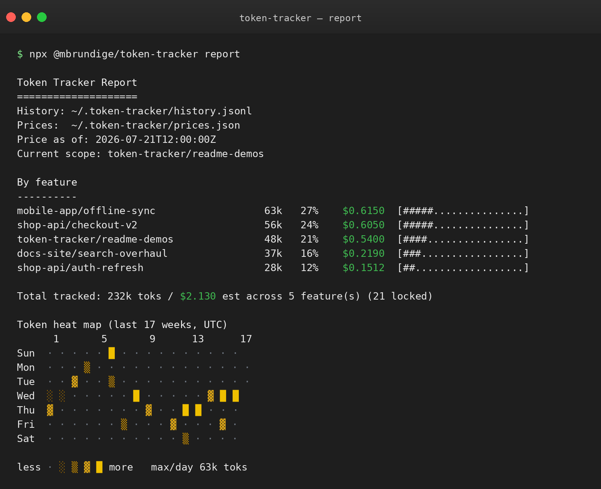
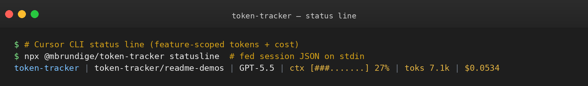
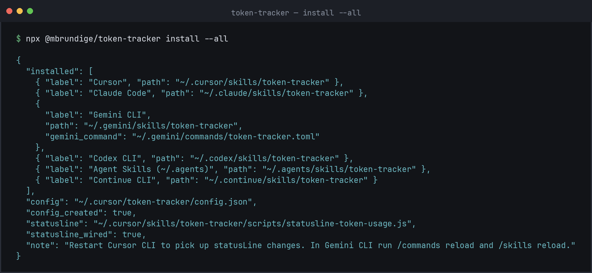
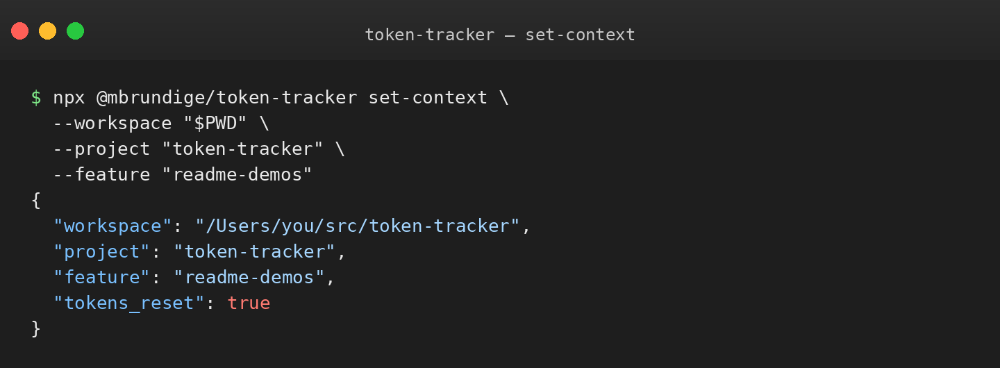
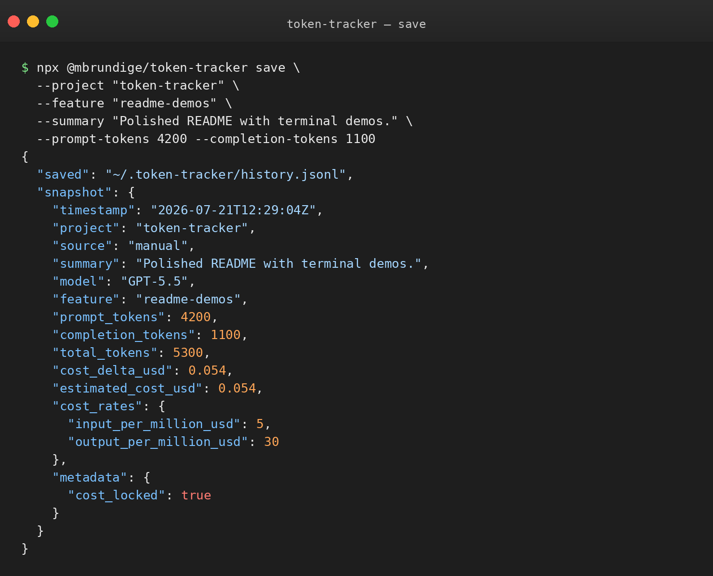

<p align="center">
  
</p>

<p align="center">
  <strong>Local token usage tracking</strong> for Cursor, Claude Code, Gemini CLI, Codex, Continue, and other Agent Skills hosts — snapshot AI spend by project and feature, keep a GitHub-style heat map, and optionally show a live Cursor CLI status line.
</p>

<p align="center">
  
  
  
  
  
  
</p>

No npm dependencies. Shared data lives in an agent-neutral home folder — `~/.token-tracker/` — so Cursor, Claude, Gemini, Codex, and Continue all contribute to one history.

<p align="center">
  
</p>

<p align="center">
  
</p>

## Why

AI sessions burn tokens across many threads, models, and side quests. Token Tracker answers:

- **Where did the tokens go?** Breakdown by `project/feature`, not just a session total
- **What does this week look like?** Daily heat map (same shape as a GitHub contribution graph)
- **What am I burning right now?** Optional Cursor CLI `statusLine` with feature-scoped `toks` and estimated `$` cost

Switching project or feature resets the status-line counter for that scope, so each label tracks usage from that point forward.

## Features

- **One-command install** into Cursor, Claude Code, Gemini CLI, Codex, Continue, and `~/.agents/skills`
- **Shared history** across hosts (one JSONL ledger under `~/.token-tracker/`)
- **`/token-tracker` skill** — run the report (and optionally save a snapshot) from chat
- **`/set-feature` slash command** — label the current workspace feature from chat (Cursor, Claude, Gemini)
- **Gemini custom commands** — `/token-tracker` and `/set-feature` under `~/.gemini/commands/`
- **Feature-scoped status line** — project, feature, model, context bar, token count, estimated cost
- **Estimated cost per feature** — from `prices.json` rates × prompt/completion deltas (epoch-aware)
- **Epoch-aware totals** — feature resets do not double-count growing snapshots
- **Zero runtime deps** — plain Node.js 22+ scripts

## Quick install

Install everywhere you use agent skills:

```bash
npx @mbrundige/token-tracker install --all
```

Or pick hosts:

```bash
npx @mbrundige/token-tracker install --cursor --claude --gemini --codex
```

<p align="center">
  
</p>

### Supported hosts

| | Flag | Host | Skill path | Extra |
| --- | --- | --- | --- | --- |
|  | `--cursor` | Cursor | `~/.cursor/skills/token-tracker` | Optional CLI `statusLine`; installs `/set-feature` |
|  | `--claude` | Claude Code | `~/.claude/skills/token-tracker` | Installs `/set-feature` |
|  | `--gemini` | Gemini CLI | `~/.gemini/skills/token-tracker` | Also installs `/token-tracker` and `/set-feature` commands |
|  | `--codex` | Codex CLI | `~/.codex/skills/token-tracker` | Invoke with `$token-tracker` / skills UI |
|  | `--agents` | Agent Skills standard | `~/.agents/skills/token-tracker` | Shared path used by Gemini and other tools |
|  | `--continue` | Continue CLI | `~/.continue/skills/token-tracker` | |
|  | `--all` | All of the above | | Includes Cursor `statusLine` by default |

**After install**

- Cursor: restart Cursor CLI if you enabled the status line
- Gemini: run `/skills reload` and `/commands reload`
- Codex / Continue / others: restart or reload skills if the skill does not appear

### Install options

| Flag | Effect |
| --- | --- |
| `--statusline` | Force Cursor CLI `statusLine` wiring |
| `--no-statusline` | Skip `statusLine` changes |

Defaults when no target flags are set: `--cursor` and `--statusline`.

Install also writes a `token-tracker` launcher to `~/.local/bin/token-tracker` (and a shared CLI under `~/.token-tracker/cli/`). If your shell cannot find `token-tracker`, add `~/.local/bin` to `PATH`, or keep using `npx @mbrundige/token-tracker …` / `node ~/.cursor/skills/token-tracker/scripts/….js`.

## Requirements

- Node.js **22+**
- At least one supported host with personal/user skills enabled
- Optional: `git` (falls back to the current branch as the feature name)

## Label a project and feature

```bash
npx @mbrundige/token-tracker set-context \
  --workspace "$PWD" \
  --project "token-tracker" \
  --feature "readme-demos"
```

Or set only the feature (CLI or slash command):

```bash
npx @mbrundige/token-tracker set-feature readme-demos
npx @mbrundige/token-tracker set-feature --clear
```

In chat:

| Host | Command |
| --- | --- |
| Cursor | `/set-feature checkout-v2` (installs `~/.cursor/commands/set-feature.md`) |
| Claude Code | `/set-feature checkout-v2` (installs `~/.claude/commands/set-feature.md`) |
| Gemini CLI | `/set-feature checkout-v2` (installs `~/.gemini/commands/set-feature.toml`) |

<p align="center">
  
</p>

`tokens_reset: true` means the status-line counter will start at `0` for the new scope.

### Resolution order

**Feature**

1. `TOKEN_TRACKER_FEATURE`
2. Workspace path in `~/.token-tracker/config.json` under `features`
3. `default_feature`
4. Current git branch

**Project**

1. `TOKEN_TRACKER_PROJECT`
2. Workspace path under `projects`
3. `default_project`
4. Workspace folder name

## Report

```bash
npx @mbrundige/token-tracker report
```

Shows usage by feature (token bar chart + estimated cost) and a daily heat map.

In chat, invoke the skill:

| Host | How |
| --- | --- |
| Cursor / Claude Code / Continue | `/token-tracker` (skill); Cursor/Claude also get `/set-feature` |
| Gemini CLI | `/token-tracker` and `/set-feature` custom commands (or skill activation) |
| Codex CLI | `$token-tracker` or skills UI |

History file (shared by all hosts):

```text
~/.token-tracker/history.jsonl
```

## Save a snapshot

```bash
npx @mbrundige/token-tracker save \
  --project "token-tracker" \
  --feature "readme-demos" \
  --summary "Polished README with terminal demos." \
  --prompt-tokens 4200 \
  --completion-tokens 1100
```

<p align="center">
  
</p>

You can also pass a full JSON object with `--json '...'` or on stdin. Snapshots store summaries and counts — not prompts or transcripts.

**Underscore aliases**: For convenience, token flags accept both kebab-case (`--prompt-tokens`) and underscore (`--prompt_tokens`) forms. The same applies to `--total-tokens`, `--completion-tokens`, and `--metadata-json`.

## Status line

Cursor CLI can show a live line like:

```text
token-tracker | token-tracker/readme-demos | GPT-5.5 | ctx [###.......] 27% | toks 7.1k | $0.0534
```

Configure visible fields in `~/.token-tracker/config.json`:

```json
{
  "statusline": {
    "enabled": true,
    "show_label": true,
    "show_project": true,
    "show_feature": true,
    "show_model": true,
    "show_context": true,
    "show_tokens": true,
    "show_cost": true
  }
}
```

### Estimated cost

Cost is **feature-scoped**, same as `toks`:

1. Status line uses current feature prompt/completion totals × rates for the active model
2. Report walks history chronologically, prices **positive token deltas** between snapshots, and starts a new epoch when totals drop (feature reset)

Rates live in `~/.token-tracker/prices.json` (seeded on install from `templates/prices.json`):

```json
{
  "default": {
    "input_per_million_usd": 2.5,
    "output_per_million_usd": 15
  },
  "models": {
    "gpt-5.5": { "input_per_million_usd": 5, "output_per_million_usd": 30 },
    "claude opus": { "input_per_million_usd": 5, "output_per_million_usd": 25 }
  }
}
```

Model keys are case-insensitive **substrings** of the model display name; the longest match wins. These are API list-price estimates — Cursor/Claude subscriptions may bill differently, so edit the file to match your reality.

### Pull latest prices

Refresh `prices.json` from a public feed (default: OpenRouter):

```bash
npx @mbrundige/token-tracker prices pull
npx @mbrundige/token-tracker prices pull --source llmcosthub
npx @mbrundige/token-tracker prices show
```

| Source | URL |
| --- | --- |
| `openrouter` (default) | `https://openrouter.ai/api/v1/models` |
| `llmcosthub` | `https://llmcosthub.com/api/v1/pricing.json` |
| `benchgecko` | BenchGecko `pricing.json` on GitHub |

Pull writes `~/.token-tracker/prices.json` (with a `.bak` backup), keeps your existing `default` rates, and preserves any model entry marked `"locked": true`.

#### Automatic price refresh

You do **not** need to run `prices pull` yourself. Install seeds a local table, then:

1. **Install** kicks off a background pull from OpenRouter
2. **Report** pulls in the foreground when rates are still seed/missing or older than 1 hour (prints a short “Fetching/Refreshing…” note)
3. **Status line** keeps pulls in the background so it stays within Cursor’s ~1s budget

Seed files are marked `"source": "seed"` so they never look “fresh” just because the file was copied recently.

```json
{
  "prices": {
    "auto_pull": true,
    "auto_pull_interval_hours": 1,
    "source": "openrouter"
  }
}
```

Set `"auto_pull": false` (or `auto_pull_interval_hours: 0`) to disable. Manual `npx @mbrundige/token-tracker prices pull` still works when you want an immediate refresh.

#### Locked-in epoch costs

When a snapshot is saved (status line or `save`), Token Tracker records:

- `cost_delta_usd` — cost of that snapshot's token growth at **then-current** rates
- `estimated_cost_usd` — cumulative locked cost for the feature epoch

The report **prefers these locked deltas**, so historical feature cost does not drift when prices refresh. Unpriced older rows still fall back to live re-pricing. The status line shows locked history for the feature plus a live tip for tokens beyond the last snapshot (priced at current rates).

Set `"show_cost": false` to hide cost on the status line. The report still prints a cost column whenever prices are available.

Test it manually:

```bash
printf '%s' '{"session_id":"demo","cwd":"'"$PWD"'","workspace":{"current_dir":"'"$PWD"'"},"model":{"display_name":"GPT-5.5"},"context_window":{"total_input_tokens":18420,"total_output_tokens":4680,"used_percentage":27}}' \
  | npx @mbrundige/token-tracker statusline
```

## CLI reference

```text
npx @mbrundige/token-tracker install [--all] [--cursor] [--claude] [--gemini] [--codex] [--agents] [--continue] [--statusline|--no-statusline]
npx @mbrundige/token-tracker report
npx @mbrundige/token-tracker save --summary "..." [--project NAME] [--feature NAME]
npx @mbrundige/token-tracker set-context --project NAME --feature NAME [--workspace PATH]
npx @mbrundige/token-tracker set-feature NAME [--workspace PATH]
npx @mbrundige/token-tracker set-feature --clear [--workspace PATH]
npx @mbrundige/token-tracker statusline   # reads status JSON from stdin
npx @mbrundige/token-tracker prices pull [--source openrouter|llmcosthub|benchgecko]
npx @mbrundige/token-tracker prices show
```

## Manual install (from a clone)

```bash
node bin/token-tracker.js install --all
# or
npm pack
npx ./mbrundige-token-tracker-*.tgz install --gemini --codex
```

## Verify

```bash
printf '%s' '{"session_id":"install-check","cwd":"'"$PWD"'","workspace":{"current_dir":"'"$PWD"'"},"model":{"display_name":"GPT-5.5"},"context_window":{"total_input_tokens":1000,"total_output_tokens":250,"used_percentage":4}}' \
  | TOKEN_TRACKER_HISTORY=/tmp/token-tracker-install-check.jsonl \
    node scripts/statusline-token-usage.js
```

Expected shape:

```text
token-tracker | <project>/<feature> | GPT-5.5 | ctx [..........] 4% | toks 0
```

(First call for a scope baselines at `toks 0`; later calls show tokens since that baseline.)

```bash
node scripts/check.js
```

## Data layout

| Path | Purpose |
| --- | --- |
| `~/.token-tracker/` | Agent-neutral shared data home (override with `TOKEN_TRACKER_HOME`) |
| `~/.token-tracker/config.json` | Project/feature map + status line options |
| `~/.token-tracker/history.jsonl` | Append-only usage snapshots (all hosts) |
| `~/.token-tracker/prices.json` | Model rate table for estimated cost (seeded on install) |
| `~/.cursor/commands/set-feature.md` | Cursor `/set-feature` slash command (when `--cursor`) |
| `~/.claude/commands/set-feature.md` | Claude Code `/set-feature` slash command (when `--claude`) |
| `~/.gemini/commands/token-tracker.toml` | Gemini `/token-tracker` custom command (when `--gemini`) |
| `~/.gemini/commands/set-feature.toml` | Gemini `/set-feature` custom command (when `--gemini`) |

On first run / install, if `~/.token-tracker/` is empty and legacy `~/.cursor/token-tracker/` has data, files are copied over (legacy folder is left in place).

Override paths with `TOKEN_TRACKER_HOME`, `TOKEN_TRACKER_CONFIG`, `TOKEN_TRACKER_HISTORY`, and `TOKEN_TRACKER_PRICES`.

## Repo layout

| Path | Role |
| --- | --- |
| `bin/token-tracker.js` | npx CLI (`install`, `save`, `set-context`, `set-feature`, `statusline`, `report`) |
| `scripts/` | Shared Node helpers (`pricing.js`, report, statusline, …) |
| `templates/` | Skill, slash-command, Gemini command, and default `prices.json` templates used by `install` |
| `.github/workflows/` | CI checks + npm publish on `v*` tags |
| `cursor/`, `claude/`, `gemini/`, `codex/`, `agents/`, `continue/` | Checked-in `SKILL.md` copies per host |
| `docs/screenshots/` | README terminal demos |
| `docs/logos/` | Host badges + project wordmark |

## Publish (maintainers)

Releases publish to **npm** automatically when you push a version tag that matches `package.json`.

1. Bump `"version"` in `package.json` (and merge to `main`).
2. Add a repo secret **`NPM_TOKEN`** (npm access token with publish rights for `@mbrundige`).
3. Tag and push:

```bash
VERSION=$(node -p "require('./package.json').version")
git tag "v${VERSION}"
git push origin "v${VERSION}"
```

The [Publish npm](.github/workflows/publish-npm.yml) workflow then:

- checks that the tag (`v0.8.0`) matches `package.json`
- runs `node scripts/check.js`
- runs `npm publish --access public --provenance`
- creates a GitHub Release with generated notes

Manual publish still works if needed:

```bash
npm login
npm publish --access public
```

Then users can run:

```bash
npx @mbrundige/token-tracker install --all
```

## Contributors

- [Max Brundige](https://github.com/mbrundige)
- [Stephen Bowman](https://github.com/BowmanStephen)

## License

MIT
